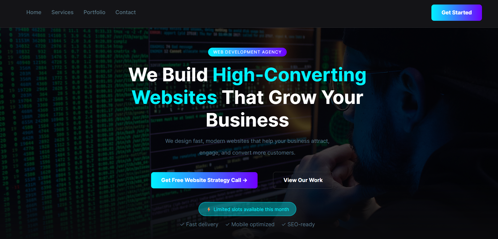

# Landing Page

The official portfolio and agency landing page, a high-performance web development agency. This project demonstrates our expertise in building modern, scalable, and conversion-optimized digital solutions.

## 📸 Preview


## 🚀 Live Demo
[https://astounding-salmiakki-8e8505.netlify.app/](https://astounding-salmiakki-8e8505.netlify.app/)

## 🛠️ Tech Stack
* **HTML5** - Semantic structure for superior SEO and accessibility.
* **CSS3** - Modern layout techniques including CSS Grid, Flexbox, and Glassmorphism effects.
* **JavaScript** - Custom interactivity, including the Intersection Observer API for scroll animations and mobile navigation logic.
* **Fonts/Icons** - Curated typography using the Inter font family for a clean, professional aesthetic.

## ✨ Key Features
* **Conversion-Driven Design:** Every section is strategically crafted to engage visitors and turn them into qualified leads through clear, high-impact Calls-to-Action (CTAs).
* **High-Performance Architecture:** Built with speed as a non-negotiable priority, featuring optimized assets and clean code to ensure top-tier Core Web Vitals.
* **Fully Responsive & Mobile-First:** Fluid, adaptive layout that provides a seamless, premium user experience across all devices—from smartphones to ultrawide desktops.
* **Intuitive Mobile Navigation:** Features a seamless, custom-built slide-out drawer menu, ensuring smooth and accessible navigation on smaller screens.
* **Sophisticated Aesthetic:** Defined by a cohesive, professional color palette and curated typography that builds immediate trust and brand authority.

## 📂 Project Structure
```text
/
├── index.html          # Primary agency landing page
├── contact.html        # Lead generation contact form
├── style.css           # Global styles, variables, and responsive media queries
├── app.js              # JavaScript for animations, mobile menu, and form handling
└── assets/             # Images, icons, and branding assets
